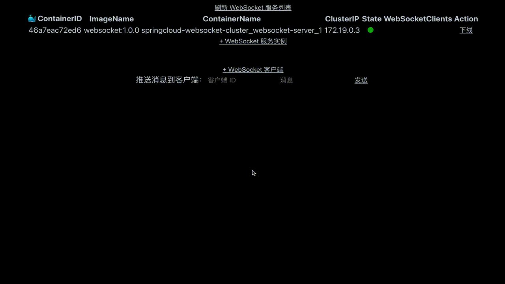

# WebSocket Cluster (Spring Cloud) in action

This is a Spring Cloud project for WebSocket cluster servers.

[中文](README.md)

## Principle

Using a consistent hashing algorithm, we construct a hash ring where the gateway listens to the up and down event of the
WebSocket service instances and dynamically updates the hash ring according to the changes of the instances. Each time a
new service comes online, the corresponding virtual node is added, and the WebSocket clients that need to change are
reconnected to the new instance. Clients that need to be changed are reconnected to the new instance, which is the least
expensive; of course, it also depends on the count of the virtual nodes and the fairness of the hashing algorithm. When
the service goes offline, it is easier -- just disconnect all clients from the current instance, and the clients will
always reconnect. At the same time, the core role of the hash ring is reflected in the load balancing. When the gateway
does its request forwarding, it goes through our rewritten custom load balancing filter, which implements real node
routing based on the fields that need to be hashed for business purposes.

## Middleware / Environment Preparation

- Docker (with API accessible)
- Redis
- RabbitMQ
- Nacos

## Development

Create a docker-compose network for [docker-compose.yml](./docker-compose.yml):

```shell
docker network create compose-network
```

Local build and deploy by docker-compose:

```shell
mvn clean
mvn install -pl gateway -am -amd
mvn install -pl websocket -am -amd
docker build -t websocket:1.0.0 websocket/.
docker build -t gateway:1.0.0 gateway/.
docker-compose up -d
docker ps
```

Scale the websocket instance by: `docker-compose scale websocket-server=3`. Actually, I wrote a front-end web page to
start a new instance for websocket service.

Don't forget to enable the docker remote api (e.g., check out `docker -H tcp://0.0.0.0:2375 ps`):
The following steps may help:

### Access docker API on Linux

Append `-H tcp://0.0.0.0:2375` to the line started of `ExecStart` in the file named `docker.service`

```shell
# cat /usr/lib/systemd/system/docker.service
ExecStart=...... -H tcp://0.0.0.0:2375
# after saved, restart the docker process
systemctl daemon-reload
systemctl restart docker
```

### Access docker API on macOS

The best practice is using the image `alpine/socat` to expose a tcp socket. (
see: [usage of socat](https://github.com/alpine-docker/socat#example)).

```shell
docker run -itd --name socat \
    -p 0.0.0.0:6666:2375 \
    -v /var/run/docker.sock:/var/run/docker.sock \
    alpine/socat \
    tcp-listen:2375,fork,reuseaddr unix-connect:/var/run/docker.sock
```

For the record, the Docker-desktop client for macOS provides the `docker.for.mac.host.internal` hostname for accessing
the host in the container of docker. I also add this domain to my `/etc/hosts` and point it to the localhost address. So
I use this address in `application.yml` to set up configuration for the redis, the rabbitmq and the nacos servers(they
are all deployed in the container). You can change this address if you deploy on your machine or other linux servers.
BTW, the Makefile is only for self usage, which makes me build and restart the service faster during the development
phase because I didn't prepare a CI/CD pipeline for this project. Please use it as needed.

## Front-end

Check out [this react app](https://github.com/Lonor/websocket-cluster-front). It looks like:



## Contribution

If this project helps, please star it. Submit an issue if you have any question. You can contribute code by forking this
project and submit your Pull Request.